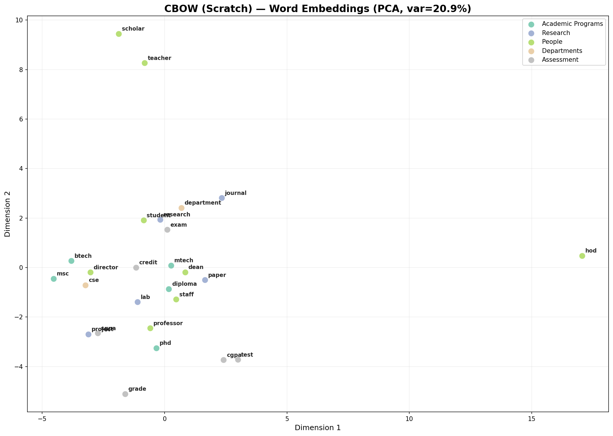

# Assignment 2: NLU Portfolio

This project implements a complete pipeline for **Domain-Specific Word Embeddings** (IIT Jodhpur Academic Corpus) and a comparative study of **Character-Level RNN Morphologies** for name generation.

## 📂 Project Structure

- **[Problem 1: IITJ Academic Corpus](./Problem1/)**: A full pipeline for scraping, preprocessing, and training Word2Vec models on IIT Jodhpur's academic data.
- **[Problem 2: Indian Name Generation](./Problem2/)**: A comparative study of Vanilla RNN, BiLSTM, and Attention-based architectures for generative tasks.

## 🚀 Quick Start

### Installation
```bash
pip install -r requirements.txt
python -m spacy download en_core_web_sm
```

### Problem 1: Word Embeddings
1. Navigate to `Problem1/`.
2. Run `summarize_results.py` to finalize already-trained models, or run the full pipeline.
3. Check `outputs/` for cluster visualizations (PCA/t-SNE).

### Problem 2: Name Generation
1. Navigate to `Problem2/`.
2. Run `generate.py` to see samples from the RNN, BiLSTM, and Attention models.
3. Check `outputs/evaluation_results.json` for comparisons.

## 📊 Sample Visualizations

*Semantic clustering of academic concepts (CSE, Engineering, Research) in the learned embedding space.*

## 📄 Documentation
Detailed technical reports and usage guides are available in the subdirectories:
- [Problem 1 README](./Problem1/README.md)
- [Problem 2 README](./Problem2/README.md)
